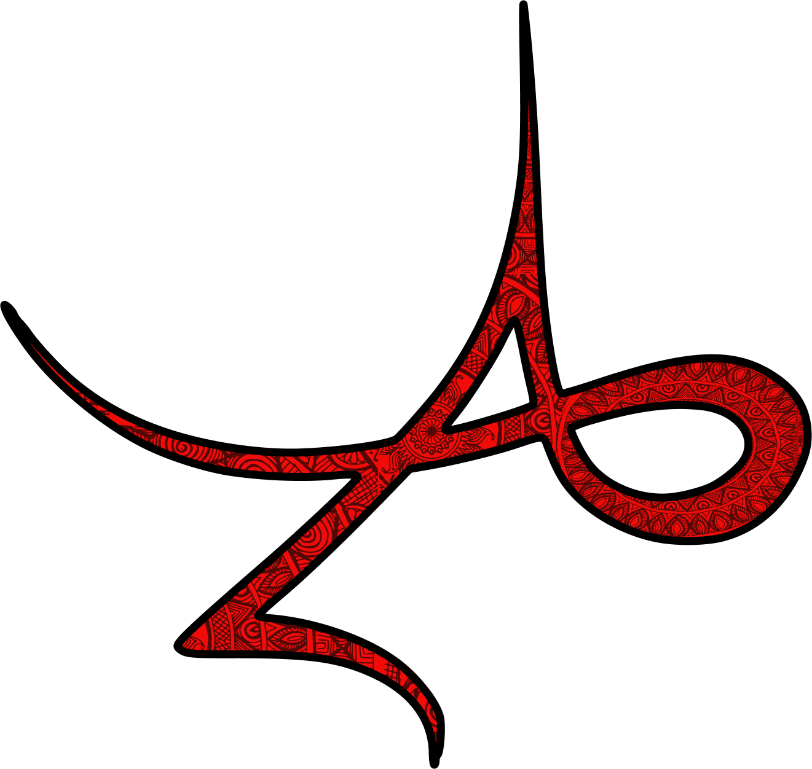

#       Anwesha 2023 Frontend

## 📜 Overview
IIT Patna’s own cultural-management fest - Anwesha is back on track this year - a saga of art, culture and celebration. Bigger, better and grander than ever before, join in and contribute to the frontend of Anwesha’s revamped website!
This is a **[Next.js](https://nextjs.org/)** project bootstrapped with [`create-next-app`](https://github.com/vercel/next.js/tree/canary/packages/create-next-app).
Beginner to intermediate levels of knowledge in **HTML**, **CSS** and **Javascript** would be enough to contribute to most of the issues in this project.

## 🤝 Contributing
1. Create a fork of this repository
2. Clone the forked repository on your local device `git clone https://github.com/<your-username>/frontend.git`
3. Make nescessary changes in code in the `main` branch of your local repository
4. After the nescessary changes/additions are made, stage and commit them using `git add .` and then `git commit -m '<Commit Message here>'`. Keep commit messages concise and to the point.
5. Push the commited changes to the `main` branch of your forked repository `git push origin main`
6. Go to your forked repository on GitHub. Create a pull request from the `🔃Contribute` button provided there. Providing a detailed description as well as screenshots and if possible, video-snippets of the changes made is highly encouraged while creating the pull request.
7. After writing code, make sure to format the code by running `yarn format` in terminal, which will automatically format everything with prettier.

## 🖥️ Running the Server
1. Install the dependencies using `yarn install`
2. Run the server using `yarn dev`
3. Server should have started running
4. You can start editing the page by modifying `pages/index.js`. The page auto-updates as you edit the file.

We will review your contributions and either merge your pull request or suggest changes. Hence you are encouraged to **keep yourselves updated both on the PR chat thread as well as the discord channel** at least until your PR has been merged. Points will be awarded in **accordance with CODEPEAK's guidelines and scoring criteria**. You can connect with us on the `anwesha-frontend` discord channel of the Codepeak discord server in case any doubts or discrepancies arise.
